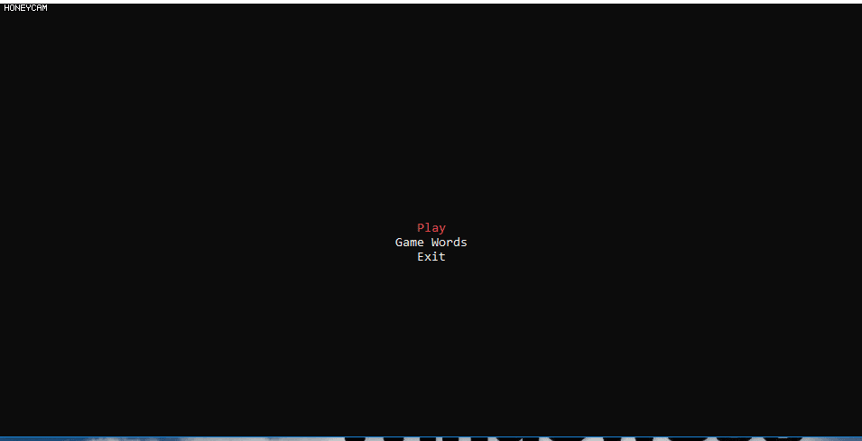

# HangMan-.NET-Framework
A personal Project about terminal based HangMan Game

### Prerequisites

Visual Studio With **atleast** .NET Framework 4.7.1 Installed 
GET [Visual Studio](https://visualstudio.microsoft.com/vs/)

### Launching the game
Click on (clone or download) button, then choose download ZIP 
naviagte to the download location and unzip the file  
Open (HangMan-.NET Framework 4.7.1.sln) 
 
now visual studio should open, so make sure you installed it 
click on (Ctrl + Alt + L) at the same time, this will open the solution explorer  
then click on anyfile you want to start editing or reading it  
Click F5 to start the game, or click on the start button 

### What is hangman?

The objective of the game Hangman is to guess the word (phrase) by suggesting letters or numbers. 
each time you fall to guess the word (phrase) you lose one point. the game will be over if you lost 3 points 

